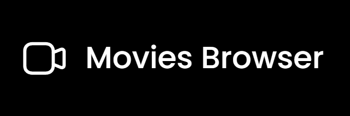

# Group project - Movies Browser

## Check the lastest version here: [Movies Browser](https://alajurczak.github.io/movies-browser/)

## Introduction
 
A fully responsive movie browser that pulls data from the [MoviesDB](https://developers.themoviedb.org/3/getting-started) API. On the site, users can search using the implemented search engine for movies, actors, and crew. 
The main page displays a list of the most popular movies in the form of tiles with basic data such as, poster, title, year of production, and category. To enter the details of a movie, just click on the selected tile. In the details you will find a description, list of actors, and crew. 

The second tab is dedicated to the most popular actors. A list of actors by name is displayed in tile form. When you click on the selected tile, you will be taken to a page with details about the selected person, where you will see a list of films in which the actor played. 

## Group project created by:

- [Alicja Jurczak](https://github.com/alajurczak) 
- [Paweł Nackowski](https://github.com/PawelNackowski)
- [Jakub Głuch](https://github.com/AllmostHumann)

## Technologies

## Getting Started with Create React App

This project was bootstrapped with [Create React App](https://github.com/facebook/create-react-app).

## Available Scripts

In the project directory, you can run:

### `npm start`

Runs the app in the development mode.\
Open [http://localhost:3000](http://localhost:3000) to view it in your browser.

The page will reload when you make changes.\
You may also see any lint errors in the console.

### `npm run build`

Builds the app for production to the `build` folder.\
It correctly bundles React in production mode and optimizes the build for the best performance.

The build is minified and the filenames include the hashes.\
Your app is ready to be deployed!

See the section about [deployment](https://facebook.github.io/create-react-app/docs/deployment) for more information.

### `npm run eject`

**Note: this is a one-way operation. Once you `eject`, you can't go back!**

If you aren't satisfied with the build tool and configuration choices, you can `eject` at any time. This command will remove the single build dependency from your project.

Instead, it will copy all the configuration files and the transitive dependencies (webpack, Babel, ESLint, etc) right into your project so you have full control over them. All of the commands except `eject` will still work, but they will point to the copied scripts so you can tweak them. At this point you're on your own.

You don't have to ever use `eject`. The curated feature set is suitable for small and middle deployments, and you shouldn't feel obligated to use this feature. However we understand that this tool wouldn't be useful if you couldn't customize it when you are ready for it.